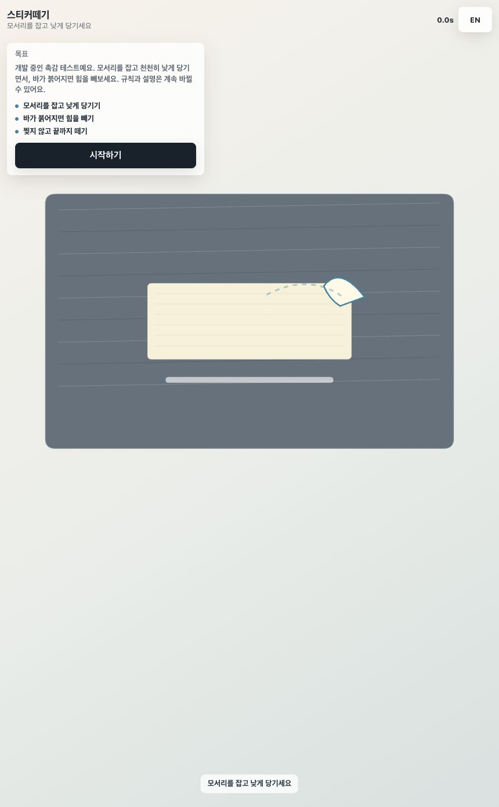
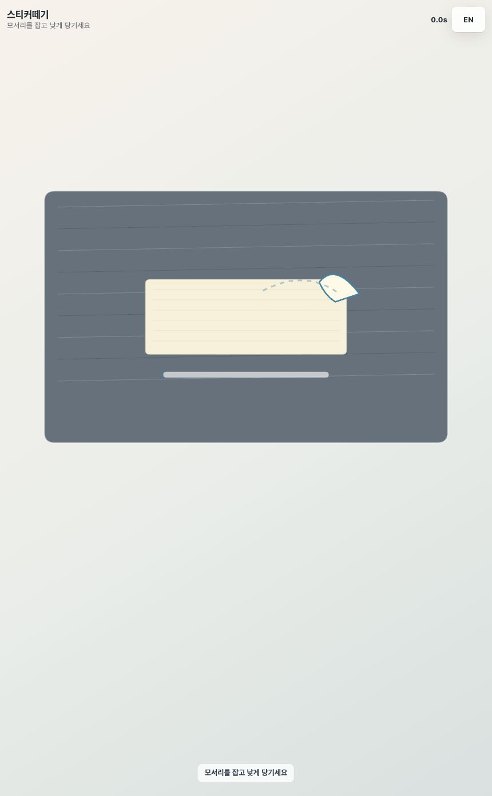
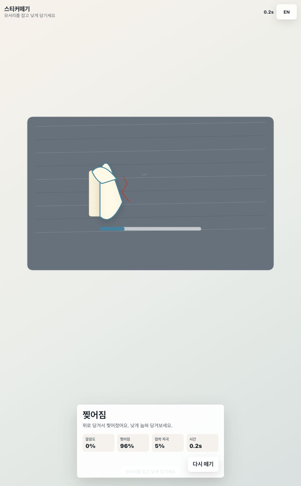

# 스티커떼기 디자인 리뷰

날짜: 2026-06-07
URL: https://kangsungbae87.github.io/perfectpeel/?v=cf3aaa7
소스 커밋: cf3aaa7

## 캡처 근거

## 현재 종료 기준

현재 구현된 종료 규칙은 코드상으로는 단순하지만 화면에서는 거의 보이지 않는다.

- 드래그 중 `physics.progress >= 1`이 되면 즉시 결과 화면으로 간다.
- 스티커가 `torn` 상태가 되면 드래그 중에는 유지되고, 손을 놓는 순간 `finishSession()`으로 결과 화면이 열린다.
- 결과 판정은 `tearPercent >= 35` 또는 `progress < 1`이면 `Torn`이 된다.

즉, 안 찢고 끝내려면 보이지 않는 진행도를 100%까지 채워야 한다. 찢어진 경우에는 손을 놓으면 끝난다. 안 찢어진 상태에서 중간에 손을 놓았을 때는 명확한 게임 결과가 없어서, 플레이어 입장에서는 "이거 언제 끝나는 거야?"라고 느끼기 쉽다.

## 종합 평가

디자인 점수: D+

AI 티 위험도: C-

촉각 게임으로서의 전제는 괜찮다. 하지만 현재 첫 화면은 "캔버스 데모 위에 웹 카드가 얹힌 화면"처럼 보인다. 흔한 보라색 SaaS 느낌은 피했지만, 카드 스타일과 기본 타이포, 탁한 색, 약한 시각 위계 때문에 완성도가 낮아 보인다. 핵심 오브젝트가 아직 "진짜 스티커를 떼는 감각"을 설득하지 못한다.

## 주요 문제

### P0 - 끝나는 기준이 화면에서 안 보인다

플레이어는 라벨 없는 가로 바와 하단 짧은 문구만 본다. "스티커를 끝까지 떼면 성공, 각도나 힘이 틀어지면 찢어짐"이라는 규칙이 화면에서 바로 읽히지 않는다. 그래서 종료 기준 질문이 자연스럽게 나온다.

필수 변경: 진행도와 실패 기준을 플레이 화면 안에 보이게 해야 한다. 진행 바는 "떼어진 정도"로 읽혀야 하고, 힘/속도 바는 단순 채움이 아니라 목표 구간을 보여줘야 한다.

### P0 - 스티커의 레이어가 구분되지 않는다

붙어 있는 부분, 들린 부분, 잡는 모서리, 바닥 종이, 접착 자국, 찢어진 선이 서로 시각적으로 싸운다. 찢어진 캡처에서는 들린 면이 왼쪽의 접힌 덩어리처럼 보이고, 어느 부분이 아직 붙어 있고 어느 부분을 잡고 있는지 알기 어렵다.

필수 변경: 아래 레이어 모델을 기준으로 다시 그려야 한다.

- 배경 작업대
- 아직 붙어 있는 스티커 면
- 하나의 명확한 peel edge
- peel edge와 연결된 들린 리본
- 포인터를 따라가는 손잡이/잡는 탭
- 진행도에 따라 남는 접착 자국

### P1 - 시작 설명 카드가 게임보다 강하다

시작 전에는 설명 패널이 게임 오브젝트보다 훨씬 강하다. 시선이 스티커가 아니라 카드로 먼저 간다. 이 때문에 "장난감"보다 "설명문이 있는 웹 페이지"처럼 느껴진다.

필수 변경: 좌상단 설명 카드를 없애고, 작고 낮은 bottom sheet 형태의 시작 상태로 바꾼다. 첫 화면의 주인공은 크게 중앙에 있는 스티커여야 한다.

### P1 - 알려주기 전에 벌을 준다

리뷰 중 실제 드래그를 넣었을 때 0.2초 만에 "찢어짐"이 나왔다. 결과 문구는 "위로 당겨서"라고 말하지만, 플레이어는 실패 전 안전한 방향이나 각도 목표를 본 적이 없다.

필수 변경: 드래그 전과 드래그 중에 방향 화살표와 안전 각도 영역을 보여줘야 한다. 초반 몇 번은 극단적인 입력이 아니면 바로 실패시키기보다 경고 피드백을 먼저 줘야 한다.

### P1 - 장력 바가 아직 게임 도구처럼 보이지 않는다

현재 바는 일반적인 로딩/진행 바처럼 보인다. 원하는 힘의 범위, 현재 힘 마커, 위험 구간, 느리게 해야 하는지 여부가 보이지 않는다.

필수 변경: 하단 HUD를 두 개의 도구로 나눈다.

- 떼기 진행도: 스티커가 얼마나 떨어졌는지
- 힘/속도 미터: 목표 구간, 현재 마커, 경고/위험 색

### P2 - 캔버스와 DOM UI가 서로 다른 앱처럼 보인다

캔버스는 탁한 일러스트 스타일인데, 설명/결과 패널은 일반 웹 카드다. 결과 패널이 플레이 표면과 재질적으로 연결되지 않는다.

필수 변경: 촉각 컨트롤, 낮은 시트, 작은 지표, 덜 일반적인 그림자 등 하나의 시각 언어로 통일한다.

### P2 - 모바일 화면에서 핵심 영역을 낭비한다

캡처 기준 플레이 표면은 화면 중간에 있고 하단에는 큰 빈 공간이 남는다. 실제 조작 대상인 스티커는 작고, 상단 텍스트와 언어 버튼이 더 눈에 띈다.

필수 변경: 좁은 화면에서는 스티커를 15-25% 키우고, HUD를 상단/하단의 예측 가능한 위치로 정리한다. 조작 대상이 가장 큰 의미 요소가 되어야 한다.

### P2 - 결과 화면은 이유를 말하지만 회복 행동을 약하게 말한다

"위로 당겨서 찢어졌어요"는 도움이 되지만, 다음 시도에서 무엇을 바꿔야 하는지가 약하다. 결과 화면은 작은 원인 리플레이나 "다음엔 더 낮게, 더 천천히" 같은 집중 목표를 줘야 한다.

필수 변경: 결과 상태에는 행동 가능한 코칭 문장 하나와 실패를 만든 힘/방향 근거가 남아야 한다.

## 추천 규칙 문구

다음 버전의 화면 규칙은 아래처럼 잡는 게 좋다.

- 성공: 스티커 떼기 진행도가 100%가 되면 성공.
- 찢어짐 실패: 찢어짐 피해가 기준치를 넘거나, 찢어진 상태에서 손을 놓으면 실패.
- 중간에 손 놓기: 85% 미만이면 살짝 되돌아가고 계속 진행, 85% 이상이면 지저분한 완료로 판정.
- 점수: 찢어짐, 접착 자국, 목표 힘 구간 유지 정도로 깔끔도를 계산.

## 다음 디자인 방향

현재 카드+캔버스 구성을 색만 다듬는 방식으로는 부족하다. 전체를 풀스크린 촉각 장난감처럼 다시 잡아야 한다.

1. 시작 상태: 크게 중앙에 있는 스티커, 작은 하단 시트, 시작 버튼 하나.
2. 플레이 상태: 설명 카드 없음, 상단에는 시간/진행도, 하단에는 힘 미터와 방향 목표.
3. 스티커 렌더링: 장식용 덩어리가 아니라 재질 레이어로 그리기.
4. 결과 상태: 하단 시트에 등급, 원인 하나, 다음 행동 힌트 하나, 다시 하기 버튼.

## 구현 순서

1. 종료/손 놓기 규칙을 코드와 문구에서 명확히 한다.
2. 설명/결과 패널을 bottom-sheet HUD 체계로 바꾼다.
3. 붙은 면, peel edge, 들린 리본, 포인터를 따라가는 손잡이 기준으로 스티커 렌더링을 다시 만든다.
4. 시작 전, 안전하게 떼는 중, 위험 경고, 찢어진 결과, 깔끔한 완료 상태의 QA 캡처를 추가한다.
